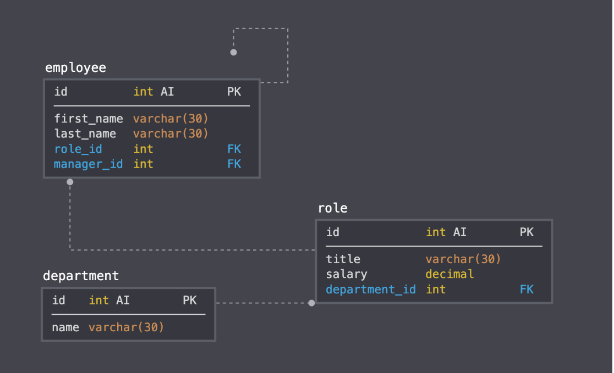
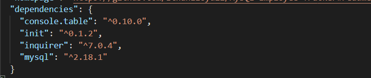
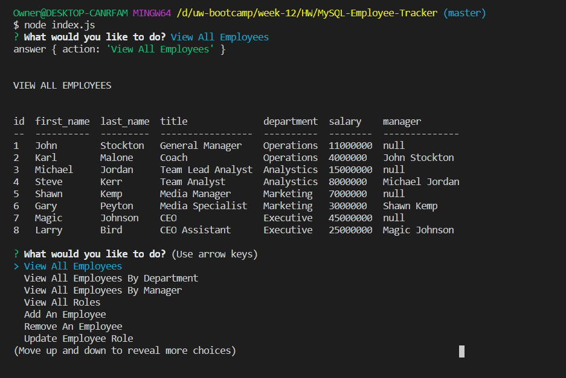

# MySQL-Employee-Tracker

MySQL-Employee-Tracker is an interface command program that make it easy for non-developers to view and interact with information stored in databases. This interface is a good example of a Content Management Systems; a command line application for managing a company's employees using node, inquirer, and MySQL.

## User Story
As a business owner
I want to be able to view and manage the departments, roles, and employees in my company
So that I can organize and plan my business

## Design

This application follows the database shcema containing three variables:

## Install
* npm i - to install all file in order for npm to work
* npm i inquirer - to use inquirer (to interact with the user via command line)
* npm init - to create a json file
* npm i mysql - to connect to MySql database
* npm console.table - to format tables

## Run 
* node index.js

## Dependencies

## Built with
* JavaScript
* jQuery
* ES6+
* Node.js
* MySQL

## Demo

Do you want to learn more about this program? Please <a href="https://drive.google.com/file/d/1YR7YOwPlGoaFdIdoFeKc9-ysnnY5sM2P/view"> click here for a video demo </a>.

